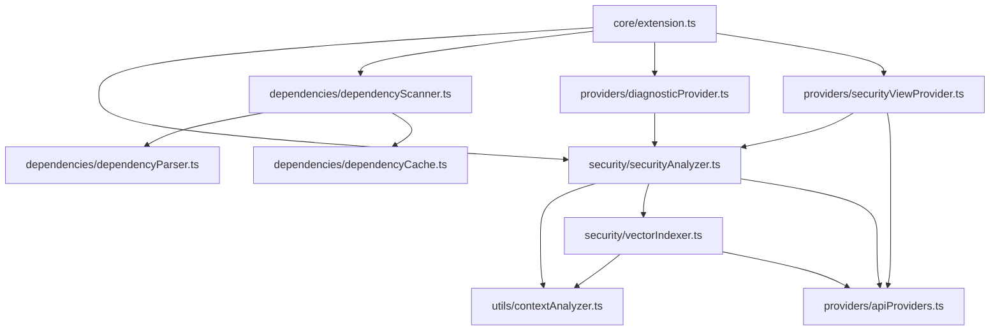

# VulnZap Extension Source Code Organization

This document describes the organized folder structure of the VulnZap VS Code extension source code.

## Folder Structure

```
src/
├── core/           # Main extension entry point and core functionality
├── security/       # Security analysis and vector indexing components
├── dependencies/   # Dependency vulnerability scanning components
├── providers/      # Service providers (API, diagnostics, view)
├── utils/          # Utility functions and analyzers
└── index.ts        # Main export file for all components
```

## Detailed Component Organization

### 📁 `core/`
**Purpose**: Contains the main extension entry point and core activation logic.

- `extension.ts` - Main extension activation/deactivation and command registration
- `index.ts` - Exports the main activate/deactivate functions

### 📁 `security/` 
**Purpose**: Security analysis engine and vector-based code similarity analysis.

- `securityAnalyzer.ts` - Core AI-powered security vulnerability detection
- `vectorIndexer.ts` - Vector-based code similarity and context analysis
- `index.ts` - Exports SecurityAnalyzer, VectorIndexer, and related interfaces

### 📁 `dependencies/`
**Purpose**: Dependency vulnerability scanning and management.

- `dependencyParser.ts` - Parses dependencies from various ecosystem files (package.json, requirements.txt, etc.)
- `dependencyCache.ts` - Caches scan results with intelligent invalidation
- `dependencyScanner.ts` - Batch API scanning and vulnerability detection
- `index.ts` - Exports dependency scanning components and interfaces

### 📁 `providers/`
**Purpose**: Service providers that integrate with VS Code's APIs.

- `apiProviders.ts` - API provider management for VulnZap and AI services
- `diagnosticProvider.ts` - VS Code diagnostics integration for security issues
- `securityViewProvider.ts` - Tree view provider for security panel
- `index.ts` - Exports all provider classes and interfaces

### 📁 `utils/`
**Purpose**: Utility functions and helper components.

- `contextAnalyzer.ts` - Code context analysis for improved accuracy
- `index.ts` - Exports utility classes and interfaces

## Import Patterns

### Importing from Specific Folders
```typescript
// Import security components
import { SecurityAnalyzer, SecurityIssue } from '../security/securityAnalyzer';
import { VectorIndexer } from '../security/vectorIndexer';

// Import dependency components
import { DependencyScanner } from '../dependencies/dependencyScanner';
import { DependencyParser } from '../dependencies/dependencyParser';

// Import providers
import { APIProviderManager } from '../providers/apiProviders';
import { DiagnosticProvider } from '../providers/diagnosticProvider';

// Import utilities
import { ContextAnalyzer } from '../utils/contextAnalyzer';
```

### Using Index Files (Recommended)
```typescript
// Import from folder index files for cleaner imports
import { SecurityAnalyzer, VectorIndexer } from '../security';
import { DependencyScanner, DependencyParser } from '../dependencies';
import { APIProviderManager, DiagnosticProvider } from '../providers';
import { ContextAnalyzer } from '../utils';
```

### Main Index File
```typescript
// Import everything from the main src index
import { 
  SecurityAnalyzer, 
  DependencyScanner, 
  APIProviderManager 
} from '../src';
```

## Benefits of This Organization

### 🎯 **Logical Separation**
- Each folder has a clear, single responsibility
- Related components are grouped together
- Easy to locate specific functionality

### 📈 **Scalability** 
- New features can be added to appropriate folders
- Folder structure supports growth without confusion
- Clear boundaries between different concerns

### 🔧 **Maintainability**
- Easier debugging and issue resolution
- Clear dependency relationships
- Simplified testing and refactoring

### 👥 **Developer Experience**
- New developers can quickly understand the codebase
- Consistent import patterns across the project
- Clear separation of concerns

## Component Dependencies



## Future Enhancements

This organized structure supports future enhancements:

- **New Security Features**: Add to `security/` folder
- **Additional Ecosystems**: Extend `dependencies/` parsers
- **New Providers**: Add to `providers/` folder  
- **Utility Functions**: Add to `utils/` folder
- **Testing**: Mirror structure in `test/` folder

Each folder can grow independently while maintaining clear boundaries and responsibilities.